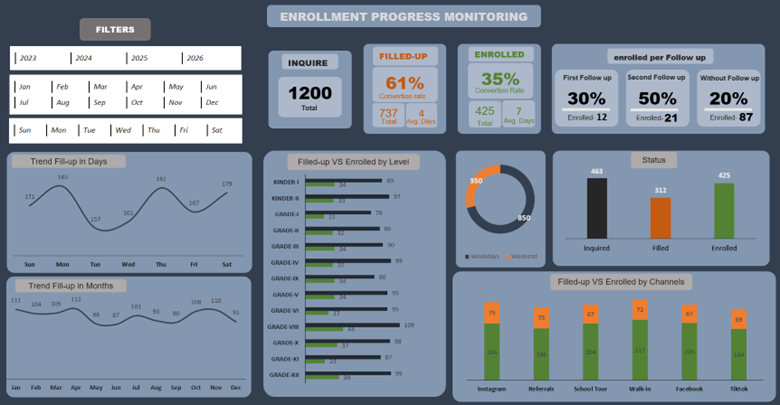

# **Enrollment Progress Monitoring Dashboard**
## Overview
### This Enrollment Progress Monitoring Dashboard is a comprehensive tool designed to track and analyze student enrollment data over time. Built entirely in Microsoft Excel, it demonstrates the power of Excel in transforming raw data into actionable insights for decision-making.  

### The dashboard allows users to monitor enrollment progress, track follow-ups, and evaluate trends across different levels, channels, and time periods. It’s designed for school administrators, data analysts, and decision-makers who need a clear, real-time view of enrollment performance.  

## Key Features  
- Dynamic Filters: Filter data by year, month, or day to analyze trends over time.
- Enrollment Metrics:

- Inquiries: Total number of potential students.

- Filled-Up: Conversion rate of inquiries to completed applications.

- Enrolled: Conversion rate of inquiries to actual enrolled students.

- Follow-Up Analysis: Understand the effectiveness of follow-ups on enrollment:

- First follow-up: 30% enrollment

- Second follow-up: 50% enrollment

- Without follow-up: 20% enrollment

- Trend Analysis:

- Fill-up trends by day of the week and month to identify peak enrollment periods.

- Level-wise Insights: Compare filled-up vs enrolled numbers across all grade levels (Kinder I to Grade XII).

- Channel Analysis: Measure enrollment performance by channels like Instagram, Facebook, School Tours, Walk-ins, TikTok, and Referrals.

- Status Overview: Quick glance at total inquiries, filled-up applications, and enrolled students.

- Weekday vs Weekend Activity: Identify patterns in enrollment activity by day type.

  ## Key Insights  
1. Follow-up Matters: Second follow-ups have the highest enrollment success (50%), highlighting the importance of consistent communication with potential students.
2. Peak Fill-Up Days: Mondays and Thursdays show higher fill-up numbers, suggesting targeted campaigns could maximize results on these days.
3. Channel Performance: Walk-ins and social media channels (Instagram, Facebook) drive the majority of filled-up applications.
4. Conversion Gaps: While filled-up applications are high, actual enrollment averages 35%, signaling opportunities for process improvement in enrollment conversion.

## Tools & Skills Demonstrated  
- Excel Skills:
 - Power Query 
 - Power Pivot
- Formulas (e.g., DATEDIF, SUMIF, INDEX-MATCH, DAX)
- Dashboard design and visualization

- Analytical Skills:
 - Trend analysis (daily, monthly)
 - Conversion rate calculations
 - Channel effectiveness evaluation
 - Level-wise performance comparison
## Dashboard Photo

or visit to my [Dashboard](
